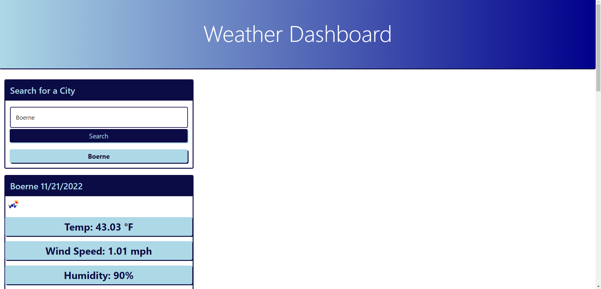

# Five-Day-Weather-Forecast
## Description
This is a simple weather application.
The purpose of this application is for the user to be able to pull up a simple weather forecast that will display both the current weather forecast and a 5 day weather forecast. The user will see Temperature, Wind, and Humidity, along with a weather icon.

## Table of Contents (Optional)
N/A

## Installation
N/A

## Usage
To use this app, the user just needs to type just the city into the search bar and hit search. 

## Credits
Credit to our instructor, students in the class, TA's, tutor, and AskBCS.

## License

---

## Link to deployed site
https://hmustain.github.io/Five-Day-Weather-Forecast/